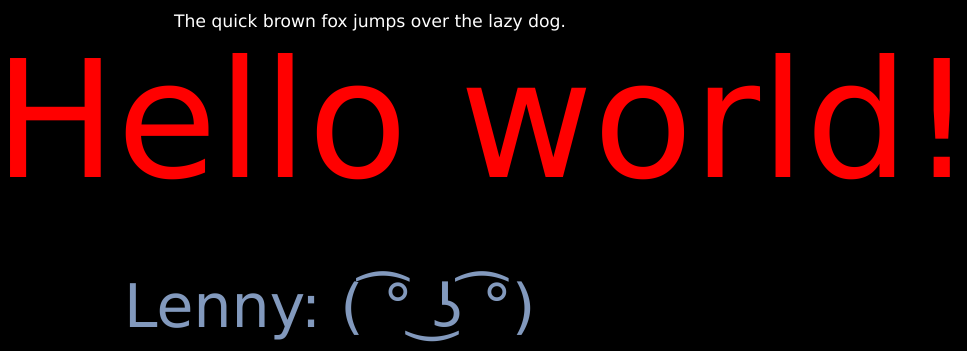

# Vulkano Text [](https://crates.io/crates/vulkano-text) [](https://docs.rs/vulkano_text) [](https://travis-ci.org/rukai/vulkano-text) [](https://deps.rs/repo/github/rukai/vulkano-text)

This library is useful if you are building a game prototype with Vulkano and want a quick way to add basic text rendering:

*   You can only use the DejaVu font
*   The text is rendered on top of the contents of your swapchain image (no depthbuffer or draw ordering)

## Usage

Below are relevant lines taken from the [triangle.rs](examples/triangle.rs) example.

Import the library:
```
extern crate vulkano_text;
use vulkano_text::{DrawText, DrawTextTrait};
```

Create DrawText:
```
let mut draw_text = DrawText::new(device.clone(), queue.clone(), swapchain.clone(), &images);
```

Specify text to draw by calling queue_text:
```
draw_text.queue_text(200.0, 50.0, 20.0, [1.0, 1.0, 1.0, 1.0], "The quick brown fox jumps over the lazy dog.");
draw_text.queue_text(20.0, 200.0, 190.0, [0.0, 1.0, 1.0, 1.0], "Hello world!");
draw_text.queue_text(x, 350.0, 70.0, [0.51, 0.6, 0.74, 1.0], "Lenny: ( ͡° ͜ʖ ͡°)");
draw_text.queue_text(50.0, 350.0, 70.0, [1.0, 1.0, 1.0, 1.0], "Overlap");
```

Call draw_text on the AutoCommandBufferBuilder after your game render pass:
```
.draw_text(&mut draw_text, image_num)
```

You will also need to recreate DrawText when you recreate your swapchain e.g. due to window resize

## Example Render

